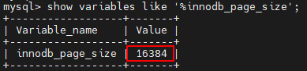
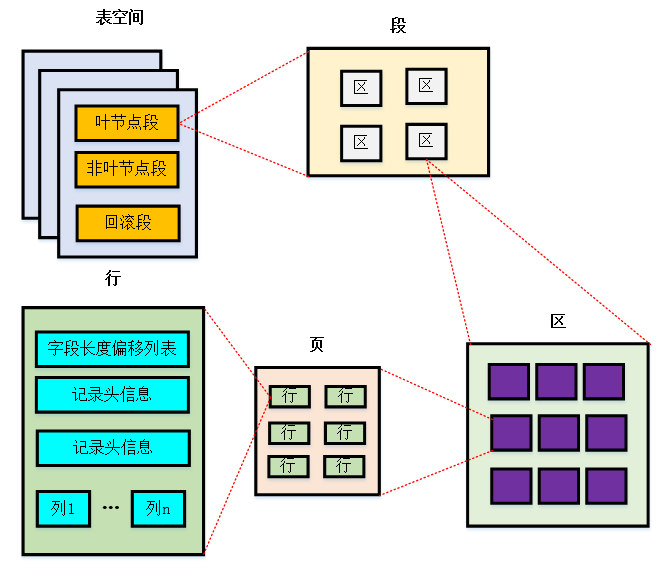
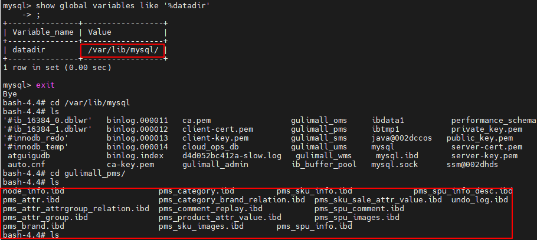
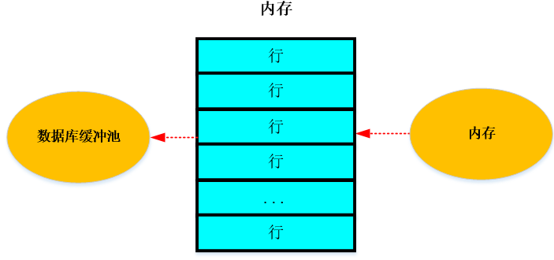
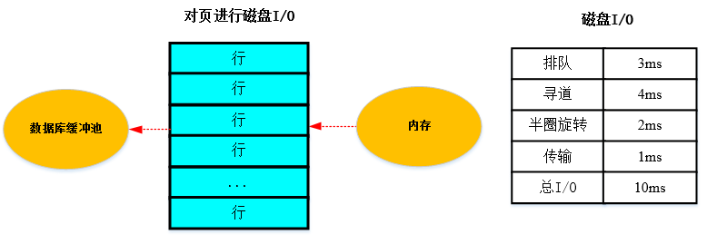

[toc]


# 第7章_InnoDB数据存储结构

## 1. 数据库的存储结构：页

索引结构给我们提供了高效的索引方式，不过索引信息以及数据记录都是保存在文件上的，确切说是存储在页结 构中。另一方面，索引是在存储引擎中实现的，MySQL服务器上的存储引擎负责对表中数据的读取和写入工作。 不同存储引擎中存放的格式一般不同，甚至有的存储引擎比如Memory都不用磁盘来存储数据。 由于InnoDB是MySQL"的默认存储引擎, 所以本章剖析InnoDB存储引擎的数据存储结构。

### 1.1 磁盘与内存交互基本单位：页

InnoDB将数据划分为若干个**<font color=red>页</font>(Page)**，页的默认大小为**<font color=red>16KB</font>**，它是**<font color=red>数据库管理存储空间和I/O操作的最小单位</font>**。页作为磁盘和内存交互的基本单位，单次磁盘读取和写入的最少内容都是16KB，改一条数据也得将整页写入覆盖。在数据库中，**<font color=red>行的读取需要先将其所在页进行加载</font>**。

> [!IMPORTANT]
>
> 记录是按照行来存储的，但数据库的读取并不是以行为单位<，否则一次读取（一次IO操作）只能处理一行数据，效率非常低。


### 1.2 页结构概述

页a、页b可以**<font color=orange>不在物理结构上相连</font>**，只要通过**<font color=orange>双向链表</font>**关联即可。每个数据页中的记录会按照主键值从小到大的顺序组成一个**<font color=orange>单向链表</font>**，每个数据页都会为存储在它里边的记录生成一个**<font color=orange>页目录</font>**，再通过主键查找某条记录的时候可以在页目录中使用**<font color=orange>二分查找</font>**快速定位到对应的槽，然后遍历该槽对应分组中的记录即可快速找到指定的记录。

### 1.3 页的大小

不同的数据库管理系统（简称DBMS）的页大小不同。比如在 MySQL 的 InnoDB 存储引擎中，默认页的大小是 `16KB`，我们可以通过下面的命令来进行查看：

```mysql
show variables like '%innodb_page_size%'
```



SQL Server 中页的大小为 `8KB`，而在 Oracle 中我们用术语 "`块`" （Block）来表示 "页"，Oracle 支持的快大小为2KB, 4KB, 8KB, 16KB, 32KB 和 64KB。

### 1.4 页的上层结构

另外在数据库中，还存在着区（Extent）、段（Segment）和表空间（Tablespace）的概念。行、页、区、段、表空间的关系如下图所示：



<font color='orange'>**区（Extent）**</font>是一个比页大一级的存储结构，在InnoDB中，一个区会分配**<font color='orange'>64个连续的页</font>**。因为InnoDB中的页大小默认是16KB，所以一个区的大小是64*16KB=<font color='orange'>**1MB**</font>。区在文件系统是一个<font color='orange'>**连续分配**</font>的空间。

<font color='orange'>**段（Segment）**</font>是由一个或多个区组成，区在文件系统是一个连续分配的空间（在InnoDB中是连续的64个页），不过在段中不要求区与区是相邻的。<font color='orange'>**段是数据库中的分配单位，不同类型的数据库对象以不同的段形式存在**</font>。当我们创建数据表、索引时，就会创建相应的段，比如创建一张表时会创建一个表段，创建一个索引时会创建一个索引段。

<font color='orange'>**表空间（Tablespace）**</font>是一个逻辑容器，存储的对象是段，在一个表空间中可以有一个或多个段，但是一个段只能属于一个表空间。数据库由一个或多个表空间组成，表空间从管理上可以划分为<font color='orange'>**系统表空间、用户表空间、撤销表空间、临时表空间**</font>等。

## 2. 页的内部结构

页如果按类型划分的话，常见的有 <font color='orange'>**数据页（保存B+树节点）、系统表、Undo 页 和 事务数据页**</font> 等。数据页是我们最常使用的页。

数据页的 `16KB` 大小的存储空间被划分为七个部分，分别是文件头（File Header）、页头（Page Header）、最大最小记录（Infimum + supremum）、用户记录（User Records）、空闲空间（Free Space）、页目录（Page Directory）和文件尾（File Tailer）。

页结构的示意图如下所示：


如下表所示：


我们可以把这7个结构分为3个部分。

### 第一部分：File Header (文件头部) 和 File Trailer (文件尾部)

首先是文件通用部分，即文件头和文件尾

- [x] **<font color='orange'>文件头信息</font>**

  


### 第二部分：User Records (用户记录)、最大最小记录、Free Space (空闲空间)

见文件InnoDB数据库存储结构.mmap

### 第三部分：Page Directory (页目录) 和 Page Header (页面头部)

见文件InnoDB数据库存储结构.mmap

### 2.3 从数据库页的角度看B+树如何查询

一颗B+树按照字节类型可以分为两部分：

1. 叶子节点，B+ 树最底层的节点，节点的高度为0，存储行记录。
2. 非叶子节点，节点的高度大于0，存储索引键和页面指针，并不存储行记录本身。


当从页结构理解 B+ 树时，可以帮我们理解一些通过索引进行检索的原理：

**<font color=red>1.B+树是如何进行记录检索的？</font>** 

如果通过B+树的索引查询行记录，首先是从B+树的根开始，逐层检索，直到找到叶子节点，也就是找到对应的数据页为止，将数据页加载到内存中，页目录中的槽(slot)采用**<font color=orange>二分查找</font>**的方式先找到"个粗略的记录分组， 然后再在分组中通过<font color=orange>**链表遍历**</font>的方式查找记录。 

2.<font color=red>**普通索引和唯一索引在查询效率上有什么不同？**</font> 

唯一索引就是在普通索引上增加了约束性，也就是关键字唯一，找到了关键字就停止检索。而普通索引，可能会存在用户记录中的关犍字相同的情况，根据页结构的原理，当读取一条记录时，不是单独将这条记录从磁盘中读出去，而是将这个记录所在的页加载到内存中进行读取。InnoDB存储引擎的页大小为16KB，在一个页中可能存储着上千条记录，因此在普通索引的字段上进行查找也就是在内存中多几次"判断下一条记录"的操作， 对于CPU来说，这些操作所消耗的时间是可以忽略不计的。所以对一个索引字段进行检索，采用普通索引还是唯 一索引在检索效率上基本没有差别。

## 3. InnoDB行格式 (或记录格式)

见文件InnoDB数据库存储结构.mmap

## 4. 区、段与碎片区

### 4.1 为什么要有区？

B+树的每一层中的页都会形成一个双向链表，如果以页为单位分配存储空间，双向链表相邻的两个页之间的**<font color=orange>物理位置可能离得非常远</font>**。之前介绍B+树索引的适用场景时特别提到范围查询只需要定位到最左边的记录和最右边的记录，然后沿着双向链表一直扫描即可，而如果链表中相邻的两个页物理位置离得非常远， 就是所谓<font color=orange>**随机I/O**</font>。由于磁盘的速度和内存的速度差了好几个数量级，<font color=orange>**随机I/O非常慢**</font>，所以应该尽量让链表中相邻的页物理位置也相邻，这样进行范围查询时才可以使用顺序 I/O。

 引入区的概念，<font color=orange>**一个区就是在物理位置上连续的64个页**</font>。因为InnoDB中的页大小默认是16KB，所以 T一个区的 大小是$64*16KB=1MB$。在表中数据量大时，为某个索引分配空间时就不再按照页为单位分配了，而是 按照<font color=orange>**区为单位分配**</font>，甚至在表中的数据特别多的时候，可以一次性分配多个连续的区。虽然可能造成一点点区间浪费(数据不足以填充满整个区)，但是从性能角度看，可以消除很多的随机IO，利大于弊。

### 4.2 为什么要有段？

对于范围查询，其实是对B+树叶子节点中的记录进行顺序扫描，而如果不区分叶子节点和非叶子节点，统统把节 点代表的页面放到申请到的区中的话，进行范围扫描的效果就大打折扣了。所以InnoDB对B+树的叶子节点和非叶子节点进行了区别对待，也就是说叶子节点有自己独有的区，非叶子节点也有自己独有的区。存放叶子节点的区的集合就是一个段(segment)，存放非叶子节点的区的集合也算是一个段。也就是说<font color=orange>**一个索引会生成2个段，一个叶子节点段，一个非叶子节点段**</font>。

除了索引的叶子节点段和非叶子节点段之外，InnoDB中还有为存储一些特殊的数据而定义的段，比如回滚段。所 以，常见的段有**数据段、索引段、回滚段</font>**。**<font color=orange>数据段即为B+树的叶子节点，索引段即为B+树的非叶子节点</font>**。

在InnoDB存储引擎中，对段的管理都是由引擎自身所完成，DBA不能也没有必要对其进行控制。这从一定程度上 简化了 DBA对于段的管理。

段其实不对应表空间中某一个连续的物理区域，而是一个逻辑上的概念，由若干个零散的页面以及一些完整的区 成。

### 4.3 为什么要有碎片区？

默认情况下，一个使用InnoDB存储引擎的表只有一个聚簇索引，一个索引会生成2个段，而段是以区为单位申请 存储空间的，一个区默认占用1M (64* 16Kb = 1024Kb)存储空间，所以**<font color=orange>默认情况下一个只存了几条记录的小表也 需要2M的存储空间么？</font>**以后每次添加一个索引都要多申请2M的存储空间？这对于存储记录比较少的表简直是天大的浪费。这个问题的症结在于到现在为止我们介绍的区都是非常纯粹的，也就是一个区被整个分配给某一个段，或者说区中的所有页面都是为了存储同一个段的数据而存在的，即使段的数据填不满区中所有的页面，那余下的页面也不能挪作他用。

为了考虑以完整的区为单位分配给某个段对于数据量较小的表太浪费存储空间的情况，InnoDB提出了一个<font color=orange>**碎片区**</font>的概念。在一个碎片区中，并不是所有的页都是为了存储同一个段的数据而存在的，而是碎片区中的页可以用于不同的目的，比如有些页用于段A，有些页用于段B，有些页甚至哪个段都不属于。<font color=orange>**碎片区直属于表空间，并不属于任何一个段**</font>。所以此后为某个段分配存储空间的策略是这样的

- 在刚开始向表中插入数据的时候，段是从某个碎片区以单个页面为单位来分配存储空间的。
- 当某个段已经占用了<font color=orange> 32个碎片区</font>页面后，就会申请以完整的区为单位来分配存储空间。

所以现在段不能仅定义为某些区的集合，更精确的应该是<font color=orange>**某些零散的页面以及一些完整的区的集合**</font>。

### 4.4 区的分类

区大体上可以分为4种类型：

* 空闲的区 (FREE) : 现在还没有用到这个区中的任何页面。
* 有剩余空间的碎片区 (FREE_FRAG)：表示碎片区中还有可用的页面。
* 没有剩余空间的碎片区 (FULL_FRAG)：表示碎片区中的所有页面都被使用，没有空闲页面。
* 附属于某个段的区 (FSEG)：每一个索引都可以分为叶子节点段和非叶子节点段。

处于FREE、FREE_FRAG 以及 FULL_FRAG 这三种状态的区都是独立的，直属于表空间。而处于 FSEG 状态的区是附属于某个段的。

> 如果把表空间比作是一个集团军，段就相当于师，区就相当于团。一般的团都是隶属于某个师的，就像是处于 FSEG 的区全部隶属于某个段，而处于 FREE、FREE_FRAG 以及 FULL_FRAG 这三种状态的区却直接隶属于表空间，就像独立团直接听命于军部一样。

## 5. 表空间

表空间是InnoDB存储引擎逻辑结构的最高层，所有的数据都存放在表空间中。它是一个<font color=orange>**逻辑容器**</font>，存储的对象是段，在一个表空间中可以有多个段，但是一个段只能属于一个表空间。表空间数据库有一个或多个表空间组成，表空间从管理上可划分为<font color=orange>**系统表空间、独立表空间、撤销表空间和临时表空间**</font>等。

mysql 容器中，查询文件存放路径：然后进/var/lib/mysql/每个数据库对应一个文件夹，文件夹中有很多.idb文件对应每张表。

```mysql
mysql> show global variables like '%datadir';
```



### 5.1 独立表空间

独立表空间，即每张表有一个独立的表空间，也就是数据和索引信息都会保存在自己的表空间中。独立的表空间 (即：单表) 可以在不同的数据库之间进行 `迁移`。

空间可以回收 (DROP TABLE 操作可自动回收表空间；其他情况，表空间不能自己回收) 。如果对于统计分析或是日志表，删除大量数据后可以通过：alter table TableName engine=innodb; 回收不用的空间。对于使用独立表空间的表，不管怎么删除，表空间的碎片不会太严重的影响性能，而且还有机会处理。

**独立表空间结构**

独立表空间由段、区、页组成。

**真实表空间对应的文件大小**

我们到数据目录里看，会发现一个新建的表对应的 .ibd 文件只占用了 96K，才6个页面大小 (MySQL5.7中)，这是因为一开始表空间占用的空间很小，因为表里边都没有数据。不过别忘了这些 .ibd 文件是自扩展的，随着表中数据的增多，表空间对应的文件也逐渐增大。

**查看 InnoDB 的表空间类型：**

```mysql
show variables like 'innodb_file_per_table'
```

你能看到 innodb_file_per_table=ON, 这就意味着每张表都会单词保存一个 .ibd 文件。

### 5.2 系统表空间

系统表空间的结构和独立表空间基本类似，只不过由于整个MySQL进程只有一个系统表空间，在系统表空间中会额外记录一些有关整个系统信息的页面，这部分是独立表空间中没有的。

**InnoDB数据字典**

当向一个表中插入一条记录时，<font color=orange>**MySQL校验过程**</font>如下：

先校验插入语句对应的表是否存在，插入的列和表中的列是否符合，如果语法没有问题，还需知道该表的聚簇索引和所有二级索引对应的根页面是哪个表空间的哪个页面，然后把记录插入对应索引的B+树中。所以MySQL除了保存插入的用户数据外，还需保存许多额外信息，例如：

- 某个表属于哪个表空间，表里有多少列
- 表对应的每一个列的类型是什么
- 该表有多少索引，每个索引对应哪几个字段，该索引对应的根页面在哪个表空间的哪个页面
- 该表有哪些外键，外键对应哪个表的哪些列
- 某个表空间对应文件系统上文件路径是什么

删除不是使用 INSERT 语句插入的用户数据，是为了更好的管理这些数据而不得以引入的一些额外数据，这些数据页称为 <font color=orange>元数据</font>。InnoDB 存储引擎特意定义了一些列的 内部系统表 (internal system table) 来记录这些元数据：

|                   表名                    |                            描述                            |
| :---------------------------------------: | :--------------------------------------------------------: |
| <font color=orange>**SYS_TABLES** </font> |              整个InnoDB存储引擎中所有的表信息              |
| **<font color=orange>SYS_COLUMNS</font>** |              整个InnoDB存储引擎中所有的列信息              |
| **<font color=orange>SYS_INDEXES</font>** |             整个InnoDB存储引擎中所有的索引信息             |
| **<font color=orange>SYS_FIELDS</font>**  |         整个InnoDB存储引擎中所有的索引对应的列信息         |
|                SYS_FOREIGN                |             整个InnoDB存储引擎中所有的外键信息             |
|             SYS_FOREIGN_COLS              |         整个InnoDB存储引擎中所有的外键对应列的信息         |
|              SYS_TABLESPACES              |            整个InnoDB存储引擎中所有的表空间信息            |
|               SYS_DATAFILES               | 整个InnoDB存储引擎中所有的表空间对应文件系统的文件路径信息 |
|                SYS_VIRTUAL                |         整个InnoDB存储引擎中所有的虚拟生成列的信息         |

这些系统表也称为 `数据字典`，它们都是以 B+ 树的形式保存在系统表空间的某个页面中。其中 `SYS_TABLES、SYS_COLUMNS、SYS_INDEXES、SYS_FIELDS` 这四个表尤其重要，称之为基本系统表 (basic system tables) ，我们先看看这4个表的结构：

<font color=orange>**SYS_TABLES表结构**</font>

|    列名    |                       描述                        |
| :--------: | :-----------------------------------------------: |
|    NAME    |                  表的名称，主键                   |
|     ID     | InnoDB存储引擎中每个表都有一个唯一的ID（—级索引） |
|   N_COLS   |                   该表列的个数                    |
|    TYPE    | 表的类型，记录了一些文件格式、行格式、压缩等信息  |
|   MIX_ID   |                   已过时，忽略                    |
|  MIX_LEN   |                表的一些额外的属性                 |
| CLUSTER_ID |                   未使用，忽略                    |
|   SPACE    |                该表所属表空间的ID                 |

**<font color=orange>SYS_COLUMNS表结构</font>**

|   列名   |                             描述                             |
| :------: | :----------------------------------------------------------: |
| TABLE_ID |         该列所属表对应的ID（与POS -起构成联合主键）          |
|   POS    |                      该列在表中是第几列                      |
|   MAME   |                          该列的名称                          |
|  MTYPE   | main data type，主数据类型，比如INT、CHAR、VARCHAR、 FLOAT、DOUBLE |
|  PRTYPE  | precise type，精确数据类型，就是修饰主数据类型的那堆东西，比如是否允许NULL值，是否允 许负数 |
|   LEN    |                 该列最多占用存储空间的字节数                 |
|   PREC   |        该列的精度，不过这列貌似都没有使用，默认值为0         |

**<font color=orange>SYS_INDEXES表结构</font>**

|      列名       |                             描述                             |
| :-------------: | :----------------------------------------------------------: |
|    TABLE_ID     |         该索引所属表对应的ID（与ID一起构成联合主键）         |
|       ID        |          InnoDB存储引擎中每个索引都有一个唯一的旧ID          |
|      NAME       |                         该索引的名称                         |
|    N_FIELDS     |                      该索引包含列的个数                      |
|      TYPE       | 该索引的类型，比如聚簇索引、唯一索引、更改缓冲区的索引、全文索引、普通二级索引等各种类型 |
|      SPACE      |                  该索引根页面所在的表空间ID                  |
|     PAGE_N0     |                   该索引根页面所在的页面号                   |
| MERGE_THRESHOLD | 如果页面中的记录被删除到某个比例，就把该页面和相邻页面合并，这个值就是这个比例 |

**<font color=orange>SYS_FIELDS表结构</font>**

|   列名   |                       描述                       |
| :------: | :----------------------------------------------: |
| INDEX_ID | 该索引列所属的索引的ID（与POS 一起构成联合主键） |
|   POS    |           该索引列在某个索引中是第几列           |
| COL_NAME |                  该索引列的名称                  |

注意：用户不能直接访问 InnoDB 的这些内部系统表，除非你直接去解析系统表空间对应文件系统上的文件。不过考虑到查看这些表的内容可能有助于大家分析问题，所以在系统数据库 `information_schema` 中提供了一些以 `innodb_sys` 开头的表:

```mysql
USE information_schema;
```

```mysql
SHOW TABLES LIKE 'innodb_sys%';
```

在 `information_scheme` 数据库中的这些以 `INNODB_SYS` 开头的表并不是真正的内部系统表 (内部系统表就是我们上边以 `SYS` 开头的那些表)，而是在存储引擎启动时读取这些以 `SYS` 开头的系统表，然后填充到这些以 `INNODB_SYS` 开头的表中。以 `INNODB_SYS` 开头的表和以 `SYS` 开头的表中的字段并不完全一样，但仅供大家参考已经足矣。

## 附录：数据页加载的三种方式

InnoDB从磁盘中读取数据 `最小单位` 是数据页。而你想得到的 id = xxx 的数据，就是这个数据页众多行中的一行。

对于MySQL存放的数据，逻辑概念上我们称之为表，在磁盘等物理层面而言是按 `数据页` 形式进行存放的，当其加载到 MySQL 中我们称之为 `缓存页`。

如果缓冲池没有该页数据，那么缓冲池有以下三种读取数据的方式，每种方式的读取速率是不同的：

**1. 内存读取**

如果该数据存在于内存中，基本上执行时间在 1ms 左右，效率还是很高的。



**2. 随机读取**

如果数据没在内存中，就需要在磁盘上对该页进行查找，整体时间预估在<font color=orange>**10ms**</font>左右，这10ms中有6ms是磁盘的实际繁忙时间（包括**<font color=orange>寻道和半圈货转时间</font>**），有3ms是对可能发生的排队时间的估计值，另外还有1ms的传输时间，将页从磁盘服务器缓冲区传输到数据库缓冲区中。这10ms看起来很快，但实际上对于数据库来说消 耗的时间已经非常长了，因为这还只是一个页的读取时间。



**3. 顺序读取**

顺序读取是一种批量读取的方式，因为请求的<font color=orange>**数据在磁盘上往往都是相邻存储的**</font>，顺序读取可以帮我们批量读取页面，这样的话，一次性加载到缓冲池中就不需要再对其他页面单独进行磁盘I/O操作了。如果一个磁盘的吞吐量是40MB/S，那么对于一个16KB大小的页来说，一次可读取2560 （ 40MB/16KB） 个页，相当于一个页的读取时间为0.4ms。<font color=orange>**采用批量读取的方式，即使是从磁盘上进行读取，效率也比从内存中只单独读取一个页的效率要高**</font>。

